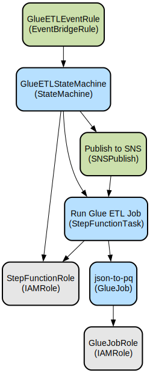

# AWS Glue ETL Pipeline with CDK Infrastructure

This project implements an automated ETL pipeline using AWS Glue, Step Functions, and EventBridge, deployed through AWS CDK. It transforms JSON data to Parquet format while incorporating data quality checks and automated error handling.

The solution provides a serverless, production-ready data processing pipeline that runs on a scheduled basis. It features comprehensive error handling through Step Functions, SNS notifications for failures, and infrastructure deployment across multiple environments (DEV, TEST, PROD) using Azure Pipelines. The pipeline includes data quality validation rules and supports parallel processing with configurable worker nodes.

## Repository Structure
```
.
├── app.py                              # CDK application entry point
├── glue_cdk_example/                   # Main application code
│   ├── constants.py                    # Environment-specific configuration
│   ├── glue_cdk_example_stack.py      # CDK stack definition
│   └── gluescripts/
│       └── json-to-pq.py              # Glue ETL transformation script
├── tests/                             # Test directory
│   └── unit/                          # Unit tests for CDK stack
├── azure-pipelines*.yml               # CI/CD pipeline definitions for different environments
├── cdk.json                           # CDK configuration
└── requirements.txt                   # Python dependencies
```

## Usage Instructions
### Prerequisites
- Python 3.12
- Node.js 20.x
- AWS CDK CLI
- AWS credentials configured
- Azure DevOps for deployment pipelines

### Installation
```bash
# Install CDK globally
npm install -g aws-cdk

# Create and activate virtual environment
python -m venv .venv
source .venv/bin/activate  # On Windows: .venv\Scripts\activate.bat

# Install dependencies
pip install -r requirements.txt
```

### Quick Start
1. Configure environment variables:
```bash
export TARGET_ENVIRONMENT=DEV  # Options: DEV, TEST, PROD
```

2. Deploy the stack:
```bash
cdk synth
cdk deploy
```

### More Detailed Examples
1. Running the Glue job manually:
```python
# The Glue job accepts the following parameters:
{
    "dbname": "<glue-database-name>",
    "table": "<source-table-name>",
    "outputpath": "s3://<bucket>/<path>"
}
```

2. Monitoring job execution:
```bash
# View Glue job logs
aws glue get-job-run --job-name json-to-pq-<account>-<region>-<environment> --run-id <run-id>

# Check Step Function execution
aws stepfunctions describe-execution --execution-arn <execution-arn>
```

### Troubleshooting
1. Glue Job Failures
- Problem: Job fails with insufficient permissions
- Solution: Check the Glue job IAM role has necessary S3 permissions
- Debug: Enable Spark UI and metrics in Glue job arguments

2. Step Function Issues
- Problem: Step Function execution timeout
- Solution: Adjust timeout in CDK stack (default 2 hours)
- Debug: Check CloudWatch logs for execution details

3. Data Quality Failures
- Problem: Data quality checks failing
- Solution: Review the default ruleset in json-to-pq.py
- Debug: Enable data quality results publishing in Glue job

## Data Flow
The pipeline processes JSON data through AWS Glue, applying schema transformations and data quality checks before outputting Parquet files. The process is orchestrated by Step Functions and triggered on a schedule via EventBridge.

```ascii
Input JSON     →     AWS Glue     →     Data Quality     →     Parquet Output
    ↓                   ↓                    ↓                      ↓
S3 Source   Schema Transform   Quality Validation    S3 Destination
```

Component interactions:
1. EventBridge rule triggers Step Function every hour at 20 minutes past
2. Step Function initiates Glue ETL job
3. Glue job reads from configured source table in Glue Data Catalog
4. Data quality rules are applied during transformation
5. Transformed data is written as Parquet to S3
6. Job status is published to SNS topic on failure
7. Step Function handles retries and error notifications

## Infrastructure


### Lambda Functions
- Glue ETL Job
  - Name: json-to-pq-{account}-{region}-{environment}
  - Worker Type: G.1X
  - Workers: 2
  - Version: Glue 5.0

### State Machines
- Name: STF-Glue-json-to-pq-{account}-{region}-{environment}
- Type: Standard
- Timeout: 2 hours

### Event Rules
- Name: STF-Hourly-Rule-{account}-{region}-{environment}
- Schedule: cron(20 * * * ? *)

### IAM Roles
- GlueJobRole: Executes Glue jobs with S3 access
- StepFunctionRole: Executes state machine with Glue and SNS permissions

## Deployment
The project supports three deployment environments through Azure Pipelines:
- DEV (us-east-1)
- TEST (us-west-2)
- PROD (us-east-2)

Each environment has its own pipeline configuration and deploys using environment-specific variables.