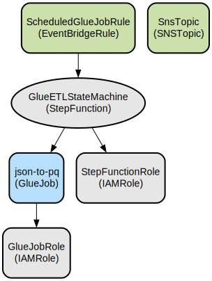

# AWS Glue ETL Pipeline with Step Functions and EventBridge Integration

This project implements an automated ETL pipeline using AWS Glue, Step Functions, and EventBridge to transform JSON data into Parquet format with data quality validation. The infrastructure is defined using AWS CDK, enabling infrastructure as code deployment across multiple environments.

The solution provides a serverless, scalable data processing pipeline that automatically executes on a scheduled basis. It includes comprehensive error handling, monitoring via SNS notifications, and data quality checks during the transformation process. The pipeline is designed to handle large-scale data processing tasks while maintaining data quality and operational reliability through automated retries and failure notifications.

## Repository Structure
```
.
├── app.py                              # CDK app entry point
├── glue_cdk_example/                   # Main application code
│   ├── constants.py                    # Configuration constants
│   ├── glue_cdk_example_stack.py      # Core infrastructure stack definition
│   └── gluescripts/
│       └── json-to-pq.py              # Glue ETL transformation script
├── tests/                             # Test directory
│   └── unit/                          # Unit tests for infrastructure
├── azure-pipelines*.yml               # CI/CD pipeline definitions
├── cdk.json                           # CDK configuration
└── requirements.txt                   # Python dependencies
```

## Usage Instructions
### Prerequisites
- Python 3.12
- Node.js 20.x
- AWS CDK CLI
- AWS account credentials configured
- Azure DevOps (for CI/CD pipeline)

### Installation
```bash
# Create and activate virtual environment
python -m venv .venv
source .venv/bin/activate  # On Windows: .venv\Scripts\activate.bat

# Install dependencies
pip install -r requirements.txt
npm install -g aws-cdk

# Bootstrap CDK (first-time only)
cdk bootstrap
```

### Quick Start
1. Configure environment variables:
```bash
# Create environment.conf file with the following content:
[DEV]
glue_db=your_database_name
table_name=your_table_name
destination_s3_location=s3://your-bucket/output/
topic_arn=arn:aws:sns:region:account:topic-name
```

2. Deploy the stack:
```bash
cdk deploy
```

### More Detailed Examples
1. Running the Glue job manually:
```python
# Using AWS SDK
import boto3

glue = boto3.client('glue')
response = glue.start_job_run(
    JobName='json-to-pq-{account}-{region}',
    Arguments={
        '--dbname': 'your_database',
        '--table': 'your_table',
        '--outputpath': 's3://your-bucket/output/'
    }
)
```

2. Monitoring job execution:
```python
response = glue.get_job_run(
    JobName='json-to-pq-{account}-{region}',
    RunId=response['JobRunId']
)
```

### Troubleshooting
1. Glue Job Failures
- Problem: Job fails with "Resource not found"
- Solution: 
  ```bash
  # Verify IAM role permissions
  aws iam get-role --role-name GlueJobRole-{account}-{region}
  # Check Glue database exists
  aws glue get-database --name your_database_name
  ```

2. Step Functions Execution Issues
- Problem: State machine fails to start Glue job
- Debug steps:
  ```bash
  # Enable logging
  aws stepfunctions update-state-machine \
    --state-machine-arn <state-machine-arn> \
    --logging-configuration level=ALL
  ```

## Data Flow
The pipeline processes JSON data through a series of transformations to produce quality-validated Parquet files. The process is triggered hourly through EventBridge and orchestrated by Step Functions.

```ascii
EventBridge Rule
      ↓
Step Functions
      ↓
Glue ETL Job → [JSON Input] → Data Quality Check → [Parquet Output]
      ↓
SNS Notification (on failure)
```

Component interactions:
1. EventBridge triggers the Step Function state machine every hour at 20 minutes past
2. Step Functions initiates the Glue ETL job with configured parameters
3. Glue job reads JSON data from the configured database table
4. Data quality rules are applied during transformation
5. Transformed data is written as Parquet files to the specified S3 location
6. Job status is monitored by Step Functions
7. Failures trigger SNS notifications for operational visibility

## Infrastructure


### Lambda Functions
- Glue ETL Job
  - Type: `glue.PySparkEtlJob`
  - Workers: 2 G.1X
  - Glue Version: 5.0
  - Max Concurrent Runs: 1

### State Machines
- ETL Orchestration State Machine
  - Type: Standard
  - Timeout: 2 hours
  - Retry Configuration: 3 attempts with 10-second intervals

### Event Rules
- Hourly Trigger
  - Schedule: `cron(20 * * * ? *)`
  - Target: ETL State Machine

### IAM Roles
- Glue Job Role: Full S3 access and Glue service role
- Step Functions Role: Permissions for Glue job execution and SNS publishing